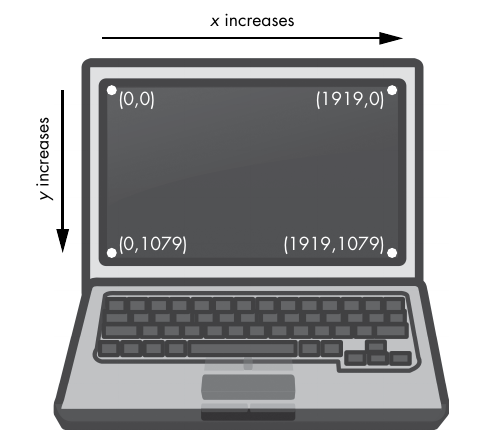
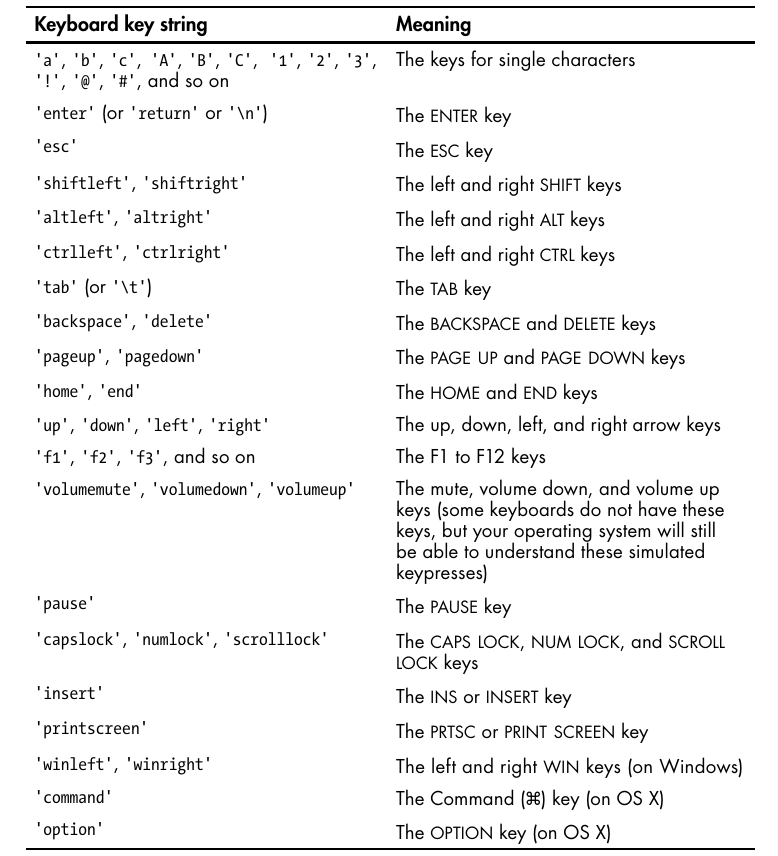
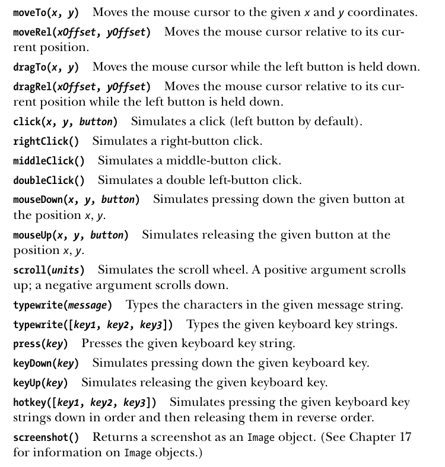

## Staying on Track
- Before you jump in to a GUI automation, you should know how to escape
problems that may arise. Python can move your mouse and type keystrokes
at an incredible speed. In fact, it might be too fast for other programs to
keep up with.
- Stopping the program can be diffi-
cult if the mouse is moving around on its own, preventing you from clicking
the IDLE window to close it. Fortunately, there are several ways to prevent
or recover from GUI automation problems.
- solutions:
    - Shutting Down Everything by Logging Out
    - You can tell your script to wait after every function call, giving you a short
window to take control of the mouse and keyboard if something goes wrong.
To do this, set the pyautogui.PAUSE variable to the number of seconds you
want it to pause. For example, after setting pyautogui.PAUSE = 1.5, every
PyAutoGUI function call will wait one and a half seconds after performing
its action. Non-PyAutoGUI instructions will not have this pause.
```py
>>> import pyautogui
>>> pyautogui.PAUSE = 1
>>> pyautogui.FAILSAFE = True
```

## Controlling Mouse Movement
- look at the image to learn about screen co-ordinates
    
- moveTo() or moveRel()
    - pyautogui.moveTo() function will instantly move the mouse cursor to a ­specified
position on the screen. Integer values for the x- and y-coordinates make up
the function’s first and second arguments, respectively. An optional ­ duration
integer or float keyword argument specifies the number of seconds it should
take to move the mouse to the destination. If you leave it out, the default is
0 for instantaneous movement. (All of the duration keyword arguments in
PyAutoGUI functions are optional.)
    - A negative integer for the first or second argument will cause the mouse to
move left or upward, respectively.

- Getting the Mouse Position: position()

## Controlling Mouse Interaction
- click(): To send a virtual mouse click to your computer, call the pyautogui.click()
method. By default, this click uses the left mouse button and takes place
wherever the mouse cursor is currently located
- If you want to specify which mouse button to use, include the button
keyword argument, with a value of 'left', 'middle', or 'right'
```py
>>> import pyautogui
>>> pyautogui.click(10, 5,button='right)
```
- other methods that use same arguments as click:
    - doubleClick()
    - middleClick()
    - rightClick()
    - mouseDown()
    - mouseUp()

- **Dragging the Mouse**
    - The arguments for dragTo() and dragRel() are the
same as moveTo() and moveRel(): the x-coordinate/horizontal movement, the
y-coordinate/vertical movement, and an optional duration of time. (OS X
does not drag correctly when the mouse moves too quickly, so passing a
duration keyword argument is recommended.)
- **Scrolling the Mouse**
    - The final PyAutoGUI mouse function is scroll(), which you pass an integer
argument for how many units you want to scroll the mouse up or down. The
size of a unit varies for each operating system and application, so you’ll have
to experiment to see exactly how far it scrolls in your particular situation.
The scrolling takes place at the mouse cursor’s current position. Passing a
positive integer scrolls up, and passing a negative integer scrolls down.

## Working with the Screen
- Your GUI automation programs don’t have to click and type blindly.
PyAutoGUI has screenshot features that can create an image file based on
the current contents of the screen. These functions can also return a Pillow
Image object of the current screen’s appearance.
```bash
# for linux we need scrot
sudo apt install scrot
```
```py
# screenshot example
import pyautogui
im=pyautogui.screenshot()
```
- all methods of PIL images can be applied to images
- **Analyzing the Screenshot**
    - Say that one of the steps in your GUI automation program is to click a gray
button. Before calling the click() method, you could take a screenshot and
look at the pixel where the script is about to click. If it’s not the same gray
as the gray button, then your program knows something is wrong. Maybe
the window moved unexpectedly, or maybe a pop-up dialog has blocked the
button. At this point, instead of continuing—and possibly wreaking havoc
by clicking the wrong thing—your program can “see” that it isn’t clicking
on the right thing and stop itself.
    - PyAutoGUI’s pixelMatchesColor() function will return True if the pixel at
the given x- and y-coordinates on the screen matches the given color. 
```py
>>> import pyautogui
>>> im = pyautogui.screenshot()
>>> im.getpixel((50, 200))
# (130, 135, 144)
>>> pyautogui.pixelMatchesColor(50, 200, (130, 135, 144))
# True
```

## Image Recognition
- But what if you do not know beforehand where PyAutoGUI should click?
You can use image recognition instead. Give PyAutoGUI an image of what
you want to click and let it figure out the coordinates.
```py
>>> import pyautogui
>>> pyautogui.locateOnScreen('submit.png')
# (643, 745, 70, 29)
```
- If the image cannot be found on the screen, locateOnScreen() will
return None. Note that the image on the screen must match the provided
image perfectly in order to be recognized. If the image is even a pixel off,
locateOnScreen() will return None.
- If the image can be found in several places on the screen,
locateAllOnScreen() will return a Generator object, which can be passed
to list() to return a list of four-integer tuples. 
```py
>>> list(pyautogui.locateAllOnScreen('submit.png'))
# [(643, 745, 70, 29), (1007, 801, 70, 29)]
```

## Controlling the Keyboard
- The `pyautogui.typewrite()` function sends virtual keypresses to the computer.
What these keypresses do depends on what window and text field have focus.
You may want to first send a mouse click to the text field you want in order
to ensure that it has focus.
- For characters such as A or !, PyAutoGUI will automatically simulate
holding down the shift key as well.
- important key names are:
    
- **pressing and releasing keys**
    - Much like the mouseDown() and mouseUp() functions, pyautogui.keyDown() and
pyautogui.keyUp() will send virtual keypresses and releases to the computer.
    -  If you need to type a string into a text field, the typewrite() function
is more suitable. But for applications that take single-key commands, the
press() function is the simpler approach.
```py
>>> pyautogui.keyDown('shift'); pyautogui.press('4'); pyautogui.keyUp('shift')
```
- **hotkey combinations**
    - A hotkey or shortcut is a combination of keypresses to invoke some applica-
tion function. The common hotkey for copying a selection is ctrl -C (on
Windows and Linux) or z-C (on OS X). This can be done in four steps:
```py
pyautogui.keyDown('ctrl')
pyautogui.keyDown('c')
pyautogui.keyUp('c')
pyautogui.keyUp('ctrl')
```
    - but hotkey() allows to do same thing in one line
```py
pyautogui.hotkey('ctrl', 'c')
```
    - above gives nice and compact way of doing things

## summary
