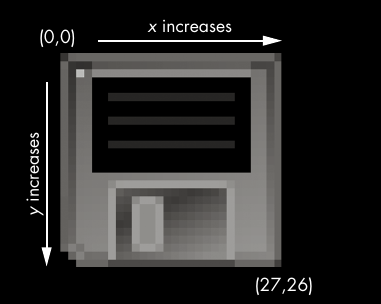

## fundamentals
- In order to manipulate an image, you need to understand the basics of how
computers deal with colors and coordinates in images and how you can
work with colors and coordinates in Pillow.
    - If a color has an alpha value of 0, it is invisible, and it doesn’t really mat-
ter what the RGB values are. After all, invisible red looks the same as invis-
ible black.
**Pillow uses the standard color names that HTML uses.**
    - Pillow offers the ImageColor.getcolor() function so you don’t have to
memorize RGBA values for the colors you want to use. This function takes
a color name string as its first argument, and the string 'RGBA' as its second
argument, and it returns an RGBA tuple.
```py
 >>> from PIL import ImageColor
 >>> ImageColor.getcolor('red', 'RGBA')
(255, 0, 0, 255)
```
- 

## import pillow/PIL
The module name of Pillow is PIL to make it
backward compatible with an older module called Python Imaging Library,
which is why you must run from PIL import Image instead of from Pillow import
Image. Because of the way Pillow’s creators set up the pillow module, you must
use the from PIL import Image form of import statement, rather than simply
import PIL.

## working with PIL
- Image.open(): To load the image, you import the Image module from Pillow and call
Image.open(), passing it the image’s filename. 
    - its width and height, the filename,
and the graphics format (such as JPEG, GIF, or PNG).

- Image.new(): Pillow also provides the Image.new() function, which returns an Image
object—much like Image.open() , except the image represented by Image.new() ’s
object will be blank. The arguments to Image.new() are as follows:
    - The string 'RGBA', which sets the color mode to RGBA. (There are other
modes that this book doesn’t go into.)
        -  nothing for the
background color v. Invisible black, (0, 0, 0, 0), is the default color used if
no color argument is specified,
    - The size, as a two-integer tuple of the new image’s width and height.

- Image.crop(): Cropping an image means selecting a rectangular region inside an image
and removing everything outside the rectangle.
    - The cropping does not happen in place—that is, the
original Image object is left untouched, and the crop() method returns a
new Image object.
- Image.copy() and Image.paste(): 
    - The copy() method will return a new Image object with the same image
as the Image object it was called on.
    - The paste() method is called `on an Image` object and `pastes another image
on **top of** it`. 
        - The paste() method takes two arguments: a “source” Image
object and a tuple of the x- and y-coordinates where you want to paste
the top-left corner of the source Image object onto the main Image object.
    - **Note** that the paste() method modifies its Image object in place; it does
not return an Image object with the pasted image. If you want to call paste()
but also keep an untouched version of the original image around, you’ll
need to first copy the image and then call paste() on that copy.

### Pasting Transparent Pixels
Normally transparent pixels are pasted as white pixels. If the image you want
to paste has transparent pixels, pass the Image object as the third argument
so that a solid rectangle isn’t pasted. This third argument is the “mask” Image
object. A mask is an Image object where the alpha value is significant, but the
red, green, and blue values are ignored. The mask tells the paste() function
which pixels it should copy and which it should leave transparent. Advanced
usage of masks is beyond this book, but if you want to paste an image that has
transparent pixels, pass the Image object again as the third argument.

## resize()
- The resize() method is called on an Image object and returns a new Image
object of the specified width and height. It accepts `a two-integer tuple argu-
ment`, representing the new width and height of the returned image.
- The resize() method accepts
only integers in its tuple argument, which is why you needed to wrap both
divisions by 2 in an int() call.
- Note that the resize() method does not edit the Image object in place
but instead returns a new Image object.

## rotate() and transpose()
- Images can be rotated with the rotate() method, which returns a new Image
object of the rotated image and leaves the original Image object unchanged.
The argument to rotate() is `a single integer or float representing` the num-
ber of degrees to rotate the image `counterclockwise.`
-  On Windows, a
black background is used to fill in any gaps made by the rotation, like in. On OS X, transparent pixels are used for the gaps instead.
The rotate() method has an optional expand keyword argument that can
be set to True to enlarge the dimensions of the image to fit the entire rotated
new image.
```py
>>> catIm.rotate(6).save('rotated6.png')
>>> catIm.rotate(6, expand=True).save('rotated6_expanded.png')
```
- You can also get a “mirror flip” of an image with the transpose() method.
You must pass either `Image.FLIP_LEFT_RIGHT` or `Image.FLIP_TOP_BOTTOM` to the
transpose() method. Like rotate(), transpose() creates a new Image object.
```py
catIm.transpose(Image.FLIP_LEFT_RIGHT).save('horizontal_flip.png')
catIm.transpose(Image.FLIP_TOP_BOTTOM).save('vertical_flip.png')
```

## change individual pixels
- getpixel(): The color of an individual pixel can be retrieved with it
- putpixel(): The color of an individual pixel can be set with it
- These methods both take a tuple representing the
x- and y-coordinates of the pixel. 

- Of course, drawing one pixel at a time onto
 putPixel.png image
an image isn’t very convenient. If you need to draw
shapes, use the ImageDraw functions

## Drawing on Images
- If you need to draw lines, rectangles, circles, or other simple shapes on
an image, use Pillow’s ImageDraw module
- Image object to the ImageDraw.Draw() function to receive an ImageDraw object.
This object has several methods for drawing shapes and text onto an Image
object.
### Drawing Shapes
- The fill argument is the color of the points and is either an RGBA tuple or a string of
a color name, such as 'red'. The fill argument is optional.
- the optional outline argument is the color of the polygon’s outline
- The optional width argument is the width
of the lines and defaults to 1 if left unspecified.


## [draw methods:](https://pillow.readthedocs.io/en/stable/_modules/PIL/ImageDraw2.html)
    - point(xy, fill) 
    - line(xy, fill, width) 
    - rectangle(xy, fill, outline): (left, top, right, bottom)
    - ellipse(xy, fill, outline): (left, top, right, bottom)
    - polygon(xy, fill, outline) 
        
- **in polygon:** The xy
argument is a list of tuples, such as [(x, y), (x, y), ...], or integers, such
as [x1, y1, x2, y2, ...], representing the connecting points of the polygon’s
sides. The last pair of coordinates will be automatically connected to the
first pair.
- **resource:** There are several other shape-drawing methods for ImageDraw objects.
The full documentation is available at http://pillow.readthedocs.org/en/latest/
reference/ImageDraw.html.

### Drawing Text
The ImageDraw object also has a text() method for drawing text onto an
image. The text() method takes four arguments: xy, text, fill, and font.

- The xy argument is a two-integer tuple specifying the upper-left corner
of the text box.
- The text argument is the string of text you want to write.
- The optional fill argument is the color of the text.
- The optional font argument is an ImageFont object, used to set the type-
face and size of the text. This is described in more detail in the next
section.

- Both text() and textsize() take an optional ImageFont object as their
final arguments. To create one of these objects, first run the following:
- Since it’s often hard to know in advance what size a block of text will
be in a given font, the ImageDraw module also offers a textsize() method.
Its first argument is the string of text you want to measure, and its second
argument is an optional ImageFont object. The textsize() method will then
return a two-integer tuple of the width and height that the text in the given

